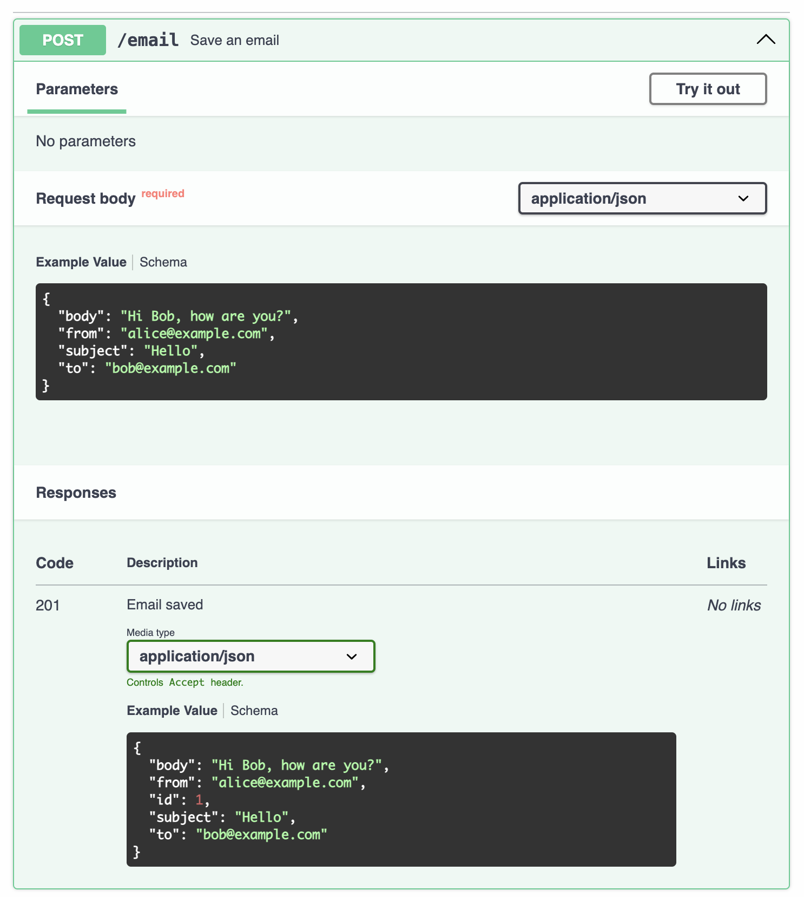

[](https://sinan-ozel.github.io/pytest-openapi/)


# 🧪 OpenAPI Contract Tester

An opinionated, lightweight **black-box contract tester** against a **live API** using its OpenAPI specification as the source of truth.

This tool validates OpenAPI quality, generates test cases from schemas, and verifies that real HTTP responses match the contract.
This "certifies" that the documentation is complete with descriptions, example, and schema, and that the endpoint behaves as the documentation suggests.

## Why?

This package tries to simulate the frustrations of API users, as consumers.
With the rise of "agents", this type of documentation-code match became even
more important, because LLMs really have trouble choosing tools or using them
properly when they do not work as intended.

## ✨ What it does

### ▶️ Quick Example



```bash
pytest --openapi=http://localhost:8000
```

```
Test #10 ✅
POST /email
Requested:
  {
    "body": "Lorem ipsum dolor sit amet",
    "from": "Lorem ipsum dolor sit amet",
    "subject": "Lorem ipsum dolor sit amet",
    "to": "Test!@#$%^&*()_+-=[]{}|;:<>?,./`~"
  }

Expected 201
  {
    "body": "Hi Bob, how are you?",
    "from": "alice@example.com",
    "id": 1,
    "subject": "Hello",
    "to": "bob@example.com"
  }

Actual 201
  {
    "body": "Lorem ipsum dolor sit amet",
    "from": "Lorem ipsum dolor sit amet",
    "id": 10,
    "subject": "Lorem ipsum dolor sit amet",
    "to": "Test!@#$%^&*()_+-=[]{}|;:<>?,./`~"
  }

```
Generates multiple QA tests.

✔️ Validates OpenAPI request/response definitions
✔️ Enforces schema field descriptions
✔️ Generates test cases from schemas, checks response codes and types in the response
✔️ Tests the exanples
✔️ Tests **GET / POST / PUT / DELETE** endpoints
✔️ Compares live responses against examples
✔️ Produces a readable test report


# ▶️ Detailed Example

## Install
```bash
pip install pytest-openapi
```

## Run

Say that you have a service running at port `8000` on `localhost`. Then, run:

```bash
pytest --openapi=http://localhost:8000
```

### Options

- `--openapi=BASE_URL`: Run contract tests against the API at the specified base URL
- `--openapi-no-strict-example-checking`: Use lenient validation for example-based tests

#### Strict vs Lenient Example Checking

By default, pytest-openapi performs **strict matching** on example-based tests:
- When your OpenAPI spec includes explicit request/response examples, the actual response must match the example values exactly
- This ensures examples accurately reflect real API behavior

However, sometimes examples contain placeholder values (like `[1, 2, 3]`) that don't match actual responses (like `[]`). Use `--openapi-no-strict-example-checking` for lenient validation:

```bash
pytest --openapi=http://localhost:8000 --openapi-no-strict-example-checking
```

**Lenient mode** validates:
- Structure and types match (all expected keys present, correct types)
- But ignores exact values and array lengths

**Note**: Schema-generated tests always use schema validation (not affected by this flag).

## Server
See here an example server - `email-server`: [tests/test_servers/email_server/server.py](tests/test_servers/email_server/server.py)

## Resulting Tests

[tests/test_servers/email_server/email_test_output.txt](tests/test_servers/email_server/email_test_output.txt)

# Future Plans / TODO

This is a work in progress.
- [ ] A check that the example matches the schema
- [ ] Ask that 400 responses be in the documentation.
- [ ] A check for regexp and email formats.
- [ ] Extra checks from 200 or 201 messages with missing keys to see 400 messages.
- [ ] Option to turn off the description requirement.

## In Consideration
- [ ] Use LLM-as-a-judge to assess the error messages and check their spelling.

# Contributing
Contributions are welcome!

The only requirement is 🐳 Docker.

Test are containerized, run them using the VS Code task `test`. If you don't want to use VS Code, the command is `docker compose -f ./tests/docker-compose.yaml --project-directory ./tests up --build --abort-on-container-exit --exit-code-from test`. Run this before making a PR, please.

There is also a development environment for VS Code, if you need it. On this environment, you can run the task `run-mock-server` to run one of the [mock servers](tests/test_servers) and see the output.

You can add your own mock server, and then add integration tests. Just follow the same pattern as every test to make a call - `subprocess.run('pytest', '--openapi=http://your-server:8000`.

Please reformat and lint before making a PR. The VS Task is `lint`, and if you don't want to use VS Code, the command is: `docker compose -f ./lint/docker-compose.yaml --project-directory ./lint up --build --abort-on-container-exit --exit-code-from linter`. Run this before making a PR, please.

If you add a functionality, please add to the the documentation.

Please submit a pull request or open an issue for any bugs or feature requests.

The moment your PR is merged, you get a dev release. You can then set up the version number to use your changes.

# License
MIT License. See [LICENSE](LICENSE) file for the specific wording.

